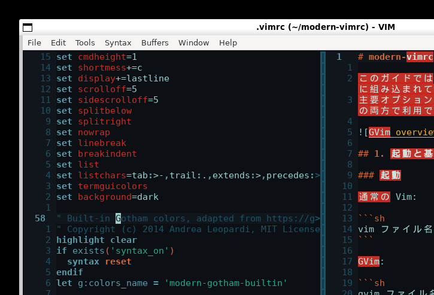
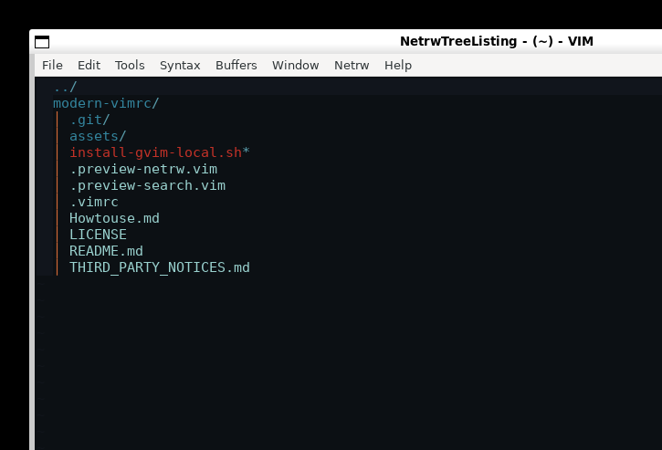

# modern-vimrc 使い方ガイド

このガイドでは、modern-vimrc に組み込まれているコマンド、キーマップ、
主要オプションの使い方を説明します。Vim と GVim の両方で利用できます。


## 1. 起動と基本操作

### 起動

通常の Vim:

```sh
vim ファイル名
```

GVim:

```sh
gvim ファイル名
```

リポジトリ内の設定を明示して試す場合:

```sh
vim -Nu .vimrc ファイル名
~/.local/bin/gvim-local -Nu .vimrc ファイル名
```

### Vim の主要モード

| モード | 入り方 | 用途 | 抜け方 |
|---|---|---|---|
| ノーマル | 起動直後 / `Esc` | 移動、削除、コピー、コマンド実行 | `i` などで別モードへ |
| 挿入 | `i`、`a`、`o` | 文字入力 | `Esc` |
| ビジュアル | `v`、`V`、`Ctrl-v` | 文字・行・矩形の選択 | `Esc` |
| コマンドライン | `:` | 保存、終了、設定変更 | `Enter` / `Esc` |
| 検索 | `/` または `?` | 前方・後方検索 | `Enter` / `Esc` |
| ターミナル | `:terminal` | Vim 内でシェルを操作 | `Esc Esc` |

この設定では Leader キーを `Space` にしています。たとえば
`Space w` は、Space を押してから `w` を押す操作です。

## 2. 保存・終了・設定管理

| キー / コマンド | 動作 | 使用例 |
|---|---|---|
| `Space w` / `:write` | 現在のファイルを保存 | 編集中に素早く保存 |
| `Ctrl-S` | GVimで現在のファイルを保存 | 挿入モード中でも保存可能 |
| `Space q` / `:quit` | 現在のウィンドウを閉じる | 分割画面を1つ閉じる |
| `Space Q` / `:quitall` | Vim全体を終了 | 全ウィンドウを閉じる |
| `Space ev` | 使用中のvimrcを編集 | 設定を変更する |
| `Space sv` / `:ReloadVimrc` | vimrcを再読込 | 再起動せず設定を反映 |
| `Space cd` | 現在のファイルの場所へ移動 | `:pwd`で移動先も表示 |

未保存の変更がある状態で終了すると、`confirm` により保存確認が表示されます。
強制終了が必要な場合は `:quit!`、全体を強制終了する場合は `:quitall!` を使います。

## 3. 表示の切り替え

| キー | 変更するオプション | 動作 |
|---|---|---|
| `Space n` | `number` / `relativenumber` | 行番号と相対行番号を切り替える |
| `Space l` | `list` | タブ、末尾空白などの不可視文字を切り替える |
| `Space z` | `wrap` | 長い行の折り返しを切り替える |
| `Esc` | `hlsearch`の表示 | 検索ハイライトを一時的に消す |

相対行番号では現在行が通常の行番号、周囲が現在行からの距離になります。
たとえば5行下へ移動するには `5j`、5行下を削除するには `5dd` が使えます。

不可視文字は次の記号で表示されます。

| 対象 | 表示 |
|---|---|
| タブ | `>-` |
| 末尾空白 | `.` |
| 画面外へ続く行 | `>` / `<` |
| ノーブレークスペース | `+` |

## 4. 検索と置換

### 検索

1. `/検索語` を入力して `Enter` を押します。
2. `n` で次の一致、`N` で前の一致へ移動します。
3. `Esc` でハイライトを消します。

`ignorecase` と `smartcase` により、小文字だけで検索すると大文字小文字を無視し、
大文字を含めると区別します。

```vim
/modern
" modern / Modern / MODERN に一致

/Modern
" Modern のみに一致
```

### 置換

```vim
:%s/古い文字列/新しい文字列/gc
```

- `%` はファイル全体
- `g` は各行の全一致箇所
- `c` は置換前の確認

`inccommand=split` 対応環境では、置換結果が確定前に分割画面でプレビューされます。



## 5. 補完

挿入モードで `Ctrl-Space` を押すとVim標準補完を開始します。

| キー | 動作 |
|---|---|
| `Ctrl-Space` | 標準キーワード補完を開始 |
| `Tab` | 次の補完候補 |
| `Shift-Tab` | 前の補完候補 |
| `Ctrl-e` | 補完を中止 |
| `Ctrl-y` | 選択候補を確定 |

補完元は現在のバッファ、他のウィンドウ、読み込まれたバッファ、未読込バッファ、
タグ、インクルードファイルです。

## 6. ファイルブラウザ

`Space e` または `:Lexplore` でVim標準のファイルブラウザ netrw を開きます。



| netrw内のキー | 動作 |
|---|---|
| `Enter` | ファイルを開く / ディレクトリへ入る |
| `-` | 親ディレクトリへ移動 |
| `D` | ファイルまたはディレクトリを削除 |
| `R` | 名前を変更 |
| `%` | 新しいファイルを作成 |
| `d` | 新しいディレクトリを作成 |
| `i` | 表示形式を切り替える |
| `Space e` / `:Lexplore` | ファイルブラウザを閉じる |

この設定ではツリー表示、左側25%幅、ファイルを右側の垂直分割で開く動作が既定です。

## 7. バッファとウィンドウ

### バッファ

バッファはVimが開いているファイルの編集内容です。画面に表示されていなくても保持されます。

| キー / コマンド | 動作 |
|---|---|
| `]b` / `:bnext` | 次のバッファ |
| `[b` / `:bprevious` | 前のバッファ |
| `:buffers` | バッファ一覧 |
| `:buffer 番号` | 指定バッファへ移動 |
| `:bdelete` | 現在のバッファを閉じる |

`hidden` が有効なため、未保存のバッファから別バッファへ移動できます。

### 分割ウィンドウ

```vim
:split ファイル名
:vsplit ファイル名
```

| キー | 動作 |
|---|---|
| `Ctrl-h` | 左のウィンドウへ移動 |
| `Ctrl-j` | 下のウィンドウへ移動 |
| `Ctrl-k` | 上のウィンドウへ移動 |
| `Ctrl-l` | 右のウィンドウへ移動 |
| `Ctrl-Up` / `Ctrl-Down` | 高さを2行ずつ変更 |
| `Ctrl-Left` / `Ctrl-Right` | 幅を2列ずつ変更 |
| `:only` | 現在のウィンドウ以外を閉じる |

新しい水平分割は下、垂直分割は右に作られます。

## 8. Quickfix と Location List

Quickfixはプロジェクト全体の検索結果やビルドエラー、Location Listは現在の
ウィンドウ専用の結果一覧に使います。

```vim
:vimgrep /TODO/gj **/*
:copen
```

| キー / コマンド | 動作 |
|---|---|
| `Space o` / `:copen` | Quickfixを開く |
| `Space x` / `:cclose` | Quickfixを閉じる |
| `]q` / `[q` | 次 / 前のQuickfix項目 |
| `]l` / `[l` | 次 / 前のLocation List項目 |
| `q` | help、Quickfix、manウィンドウを閉じる |

## 9. ビジュアルモードと編集操作

| キー | 動作 |
|---|---|
| `<` / `>` | 選択範囲を維持したままインデント |
| `J` / `K` | 選択行を下 / 上へ移動 |
| `Space p` | 無名レジスタを上書きせず貼り付け |
| `Y` | 現在位置から行末までコピー |

システムクリップボードが利用可能なVim/GVimでは、通常のコピーや貼り付けが
`unnamed` / `unnamedplus` クリップボードと連携します。

## 10. ターミナル

```vim
:terminal
```

| キー | 動作 |
|---|---|
| `Esc Esc` | ターミナル入力モードからノーマルモードへ戻る |
| `Ctrl-h/j/k/l` | ターミナルから隣のウィンドウへ移動 |
| `i` | ターミナル入力モードへ戻る |

## 11. 独自コマンド

### `:TrimTrailingWhitespace`

ファイル全体の行末空白を削除し、カーソルと表示位置を維持します。
保存時にも自動実行されます。バイナリまたは変更不可バッファでは実行されません。

### `:ReloadVimrc`

使用中のvimrcを再読込します。`Space sv` と同じです。

## 12. 自動で行われる処理

| タイミング | 処理 |
|---|---|
| ウィンドウへ戻る / バッファへ入る / 一定時間停止 | 外部変更を確認して再読込 |
| ファイルを開く | 前回のカーソル位置を復元 |
| Markdown、テキスト、Git commitを開く | 折り返しとスペルチェックを有効化 |
| Makefileを開く | タブ文字を維持 |
| help、Quickfix、manを開く | `q`で閉じられるよう設定 |
| ファイル保存前 | 行末空白を削除 |

## 13. 主要オプション

### 編集

| オプション | 既定値 | 意味 |
|---|---|---|
| `expandtab` | 有効 | Tab入力を空白へ変換 |
| `tabstop` | `4` | ファイル内Tabの表示幅 |
| `softtabstop` | `4` | 編集時のTab幅 |
| `shiftwidth` | `4` | 自動インデント幅 |
| `shiftround` | 有効 | インデントを`shiftwidth`単位へ丸める |
| `smartindent` / `autoindent` | 有効 | 前行と構文を基準に自動インデント |
| `backspace` | `indent,eol,start` | 挿入開始位置や改行を越えて削除可能 |
| `virtualedit` | `block` | 矩形選択時に文字がない列へ移動可能 |

### 表示と移動

| オプション | 既定値 | 意味 |
|---|---|---|
| `cursorline` | 有効 | 現在行を強調 |
| `signcolumn` | `yes` | 記号列を常に確保して画面の揺れを防止 |
| `scrolloff` / `sidescrolloff` | `5` | カーソル周囲に最低5行・5列を表示 |
| `nowrap` | 有効 | 長い行を既定では折り返さない |
| `linebreak` / `breakindent` | 有効 | 折り返し時に読みやすく表示 |
| `termguicolors` | 有効 | Gothamの24-bitカラーを表示 |
| `laststatus` | `2` | ステータスラインを常時表示 |

### 検索・入力

| オプション | 既定値 | 意味 |
|---|---|---|
| `incsearch` | 有効 | 入力中の検索語を即時表示 |
| `hlsearch` | 有効 | 一致箇所を強調 |
| `wrapscan` | 有効 | ファイル末尾から先頭へ検索を継続 |
| `wildmenu` | 有効 | コマンドライン補完候補を表示 |
| `wildignorecase` | 有効 | コマンドライン補完で大文字小文字を無視 |
| `history` | `1000` | コマンド・検索履歴を1000件保持 |

### 基本動作・ファイル処理

| オプション | 既定値 | 意味 |
|---|---|---|
| `nocompatible` | 有効 | 古いVi互換ではなくVimの機能を使う |
| `filetype plugin indent on` | 有効 | ファイル形式別の機能とインデントを有効化 |
| `syntax enable` | 有効 | 構文ハイライトを有効化 |
| `autoread` | 有効 | 外部で変更されたファイルを自動再読込 |
| `confirm` | 有効 | 未保存ファイルを閉じる前に確認 |
| `mouse` | `a` | 全モードでマウスを使用 |
| `clipboard` | `unnamed,unnamedplus`を追加 | 通常レジスタをシステムクリップボードと連携 |
| `switchbuf` | `useopen,usetab,newtab` | 既存表示を優先してバッファを開く |
| `updatetime` | `300`ms | swap更新や停止イベントの待機時間 |
| `timeoutlen` | `500`ms | 複数キーのマッピング入力待ち時間 |
| `ttimeoutlen` | `20`ms | 端末キーコードの入力待ち時間 |

### 補完の内部設定

| オプション | 既定値 | 意味 |
|---|---|---|
| `completeopt` | `menuone,noselect` | 候補が1件でもメニューを出し、自動選択しない |
| `complete` | `.,w,b,u,t,i` | 現在・他ウィンドウ・バッファ・タグ・includeを補完元にする |
| `wildmode` | `longest:full,full` | 最長一致を補完後、全候補を順番に表示 |

### 表示の内部設定

| オプション | 既定値 | 意味 |
|---|---|---|
| `showmatch` | 有効 | 対応する括弧を一時表示 |
| `showcmd` | 有効 | 入力途中のノーマルモードコマンドを表示 |
| `noshowmode` | 有効 | モード表示を非表示。ステータスライン領域を整理 |
| `cmdheight` | `1` | コマンドラインを1行確保 |
| `shortmess+=c` | 有効 | 補完メニューの冗長なメッセージを省略 |
| `display+=lastline` | 有効 | 長い最終行を可能な範囲まで表示 |
| `splitbelow` / `splitright` | 有効 | 新しい分割を下または右に作る |
| `background` | `dark` | 暗色背景向けの配色として扱う |

### 編集の内部設定

| オプション | 既定値 | 意味 |
|---|---|---|
| `formatoptions-=t` | 有効 | 通常テキストを自動改行しない |
| `formatoptions+=j` | 有効 | 行結合時にコメント記号を適切に除去 |
| `nrformats-=octal` | 有効 | `Ctrl-a` / `Ctrl-x`で先頭0の数値を8進数扱いしない |

### netrw の内部設定

| 変数 | 既定値 | 意味 |
|---|---|---|
| `g:netrw_banner` | `0` | 上部バナーを非表示 |
| `g:netrw_liststyle` | `3` | ツリー形式で表示 |
| `g:netrw_browse_split` | `4` | ファイルを前のウィンドウで開く |
| `g:netrw_winsize` | `25` | netrwの幅を画面の25%にする |

### ステータスライン

画面下部には、現在のファイル情報が次の順序で表示されます。

```text
ファイル名 [変更/読取専用など]  ファイル形式 文字コード 改行形式 行:列 進捗%
```

`[+]` は未保存の変更、`[RO]` は読取専用、`unix` / `dos` は改行形式を表します。

### 一時ファイルと永続Undo

backup、swap、undoは `$XDG_STATE_HOME/vim`、未設定時は
`~/.vim/state` 以下へ種類別に保存されます。

```text
~/.vim/state/
├── backup/
├── swap/
└── undo/
```

永続Undoにより、ファイルを閉じて開き直した後でも `u` で元に戻せます。

## 14. GVim固有オプション

| オプション | 設定内容 |
|---|---|
| `lines` / `columns` | 初期サイズを40行 x 120列に設定 |
| `guifont` | WindowsはConsolas 11、その他はMonospace 11 |
| `guioptions` | ツールバーとスクロールバーを非表示 |
| `guitablabel` | タブにファイル名を表示 |
| `mousemodel` | 右クリックでコンテキストメニュー |
| `title` | ウィンドウタイトルを表示 |

## 15. カスタマイズ例

`.vimrc` の末尾で既定値を上書きできます。

```vim
" 2スペースインデント
set tabstop=2 softtabstop=2 shiftwidth=2

" 常に折り返す
set wrap

" 不可視文字を通常は隠す
set nolist

" GVimのフォントを変更
if has('gui_running')
  set guifont=Monospace\ 13
endif
```

現在値は `:set オプション名?`、ヘルプは `:help 'オプション名'` で確認できます。

```vim
:set shiftwidth?
:help 'shiftwidth'
```
