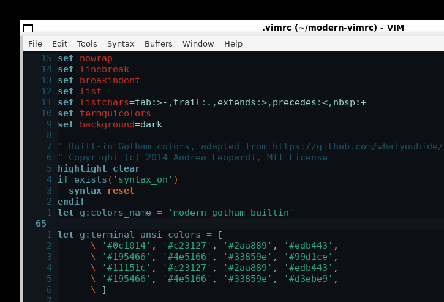

# modern-vimrc

プラグインを一切使わず、Vim 本体の機能だけで快適さを高めた Vim 8.2+ / Vim 9.x 向け設定です。
端末版 Vim と GVim の両方で同じ `.vimrc` を利用できます。

## GVim プレビュー



非常に暗い青緑系の
[vim-gotham](https://github.com/whatyouhide/vim-gotham) カラースキームを、
外部プラグイン不要のビルトイン配色として `.vimrc` に組み込んでいます。

各コマンド、キーマップ、オプションの詳しい使い方は
[Howtouse.md](Howtouse.md) を参照してください。

## できること

### 編集と表示

- 行番号、相対行番号、カーソル行、不可視文字、24-bit color を表示
- Gotham カラースキームをプラグインなしで表示
- 4 スペースのインデント、ビジュアル選択した行の移動、選択範囲を保ったインデント
- smartcase 対応のインクリメンタル検索、検索ハイライト、置換プレビュー
- Vim 標準補完を `Tab` / `Shift-Tab` / `Ctrl-Space` で操作
- ファイル保存時に末尾空白を自動除去
- Markdown、テキスト、Git commit で折り返しとスペルチェック

### ファイルとセッション

- netrw のツリー表示でファイルを閲覧
- バッファ、分割ウィンドウ、quickfix、location list をキーボードで移動
- 永続 undo、swap、backup を専用ディレクトリへ保存
- 外部で更新されたファイルを自動検出
- ファイルを開いたときに前回のカーソル位置を復元
- Vim 内蔵ターミナルを利用
- プラグイン不要のステータスラインでファイル形式、位置、進捗を確認

### GVim

- 端末版と同じキーマップ、補完、ファイルブラウザ、永続 undo を利用
- GUI 起動時だけ読みやすい等幅フォントと 120 x 40 の初期サイズを設定
- ツールバーとスクロールバーを非表示にして編集領域を確保
- ウィンドウタイトルとファイル名のタブラベルを表示
- マウスの右クリックでコンテキストメニューを表示
- `Ctrl-S` でノーマル、挿入、ビジュアルの各モードから保存

## インストール

既存の設定がある場合は、先にバックアップしてください。

### Linux / macOS / WSL

```sh
git clone https://github.com/rrryuorrr/modern-vimrc.git
ln -sfn "$PWD/modern-vimrc/.vimrc" "$HOME/.vimrc"
```

Ubuntu / WSL で GVim も使う場合:

```sh
sudo apt update
sudo apt install vim-gtk3
gvim
```

WSL では、GUI アプリを表示できる WSLg または X server が必要です。

sudo を使わず、Ubuntu 24.04 / WSL のユーザー領域だけに試験導入する場合:

```sh
./install-gvim-local.sh
~/.local/bin/gvim-local -Nu "$PWD/.vimrc"
```

このスクリプトは `vim-gtk3`、`vim-gui-common` と不足しやすいランタイムを
`~/.local/share/modern-vimrc/gvim` に展開し、`~/.local/bin/gvim-local`
から起動できるようにします。

### Windows PowerShell

```powershell
git clone https://github.com/rrryuorrr/modern-vimrc.git
Copy-Item .\modern-vimrc\.vimrc $HOME\_vimrc
```

Windows版 GVim は `_vimrc` を読み込みます。Vim の公式インストーラーまたはパッケージマネージャーで GVim を導入後、`gvim` を起動してください。

## 主要キー

Leader キーは `Space` です。

| キー | 動作 |
|---|---|
| `Space w` | 保存 |
| `Space q` | 終了 |
| `Space e` | ファイルブラウザを開く |
| `Space ev` | vimrc を編集 |
| `Space sv` | vimrc を再読込 |
| `Space cd` | 現在のファイル位置へ移動 |
| `Space n` | 行番号表示を切替 |
| `Space l` | 不可視文字表示を切替 |
| `Space z` | 折り返し表示を切替 |
| `Ctrl-S` | GVim で保存 |
| `[b` / `]b` | 前後のバッファへ移動 |
| `[q` / `]q` | 前後の quickfix 項目へ移動 |
| `Ctrl-h/j/k/l` | ウィンドウ間を移動 |
| `Esc Esc` | ターミナルモードを終了 |

## コマンド

- `:TrimTrailingWhitespace` - 末尾空白を削除
- `:ReloadVimrc` - vimrc を再読込
- `:Lexplore` - 標準ファイルブラウザを開く
- `:terminal` - Vim 内ターミナルを開く

## 動作確認

端末版 Vim で設定の読み込みエラーを確認:

```sh
vim -Nu .vimrc -n -es +'qall!'
```

GVim で設定の読み込みとGUI判定を確認:

```sh
gvim -Nu .vimrc --cmd 'set verbosefile=/tmp/modern-vimrc-gvim.log' -c 'qall!'
gvim -Nu .vimrc -c 'echo has("gui_running")'
```

GVim 上で `:echo has('gui_running')` が `1` なら、GVim 固有設定も有効です。

## カスタマイズ

`.vimrc` の末尾に設定を追加してください。たとえばインデント幅を 2 にする場合:

```vim
set tabstop=2
set softtabstop=2
set shiftwidth=2
```

## License

MIT。組み込んだ Gotham 配色のライセンスは
[THIRD_PARTY_NOTICES.md](THIRD_PARTY_NOTICES.md) を参照してください。
